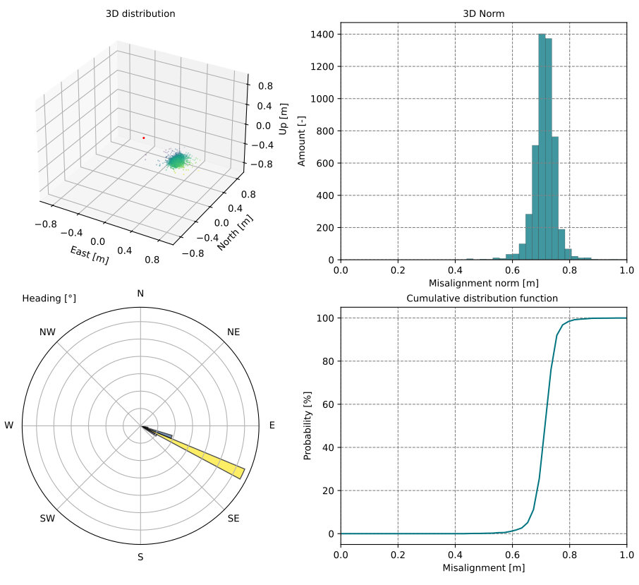

Limatch is the Python implementation of the automated lidar to lidar 3D correspondences retrieval method presented in:

### Generalization of point-to-point matching for rigorous optimization in kinematic laser scanning
Aurélien Brun, Jakub Kolecki, Muyan Xiao, Luca Insolia, Elmar Vincent van der Zwan, Stéphane Guerrier, Jan Skaloud

## Introduction

Limatch allows the automated extraction of point to point correspondences between point clouds that partially overlap. Starting from two point cloud files (las, laz or txt), Limatch outputs a set of point to point correspondences that correspond to the same physical entities over the scanned area. These correspondences can be used in several ways such as: refining the trajectory in a factor graph approach (advanced), refining the mounting and boresight parameters of the lidar, or for rigid point cloud registration.

Similar to tie point generation in photogrammetry, but applied to point clouds, Limatch implements steps of keypoints detection, description, matching, filtration and local refinement to output the final correspondences:


More details on the implementation and usage of the correspondences for trajectory refinement in MLS (car), MLS (handheld) and ALS are available in the original paper.

## Usage 

Run the matching pipeline between two example point clouds like this:

```bash
python3 matching_pipeline.py -c1 path_to_cloud_1 -c2 path_to_cloud_2 -y path_to_config.yml

```

Where c1 and c2 must be point cloud with compatible format (las, laz or ascii)

## Installation

Please use the following commands for installation.


```bash
git clone https://github.com/<your-username>/p2p.git

cd p2p

git submodule update --init

conda create -n p2p python==3.9

conda activate p2p

pip3 install torch torchvision

pip3 install -r requirements.txt
```
Note: make sure to download a pytorch + cuda version that is compatible with your NVIDIA drivers, see [here](https://pytorch.org/get-started/previous-versions/)

CUDA is optionnal but recommended for large scale data.

Key dependencies include: 

- [pytorch](https://pytorch.org/)
- [open3d](http://www.open3d.org/)
- [scipy](https://scipy.org/)
- [faiss](https://github.com/facebookresearch/faiss)
- [laspy](https://laspy.readthedocs.io/)

## Data preparation 

The pipeline operates on pairs of partially overlaping point clouds files (.txt, .las or .laz format are currently supported). To get started with a basic extraction, you will only need two point clouds with compatible format and partial overlap as input. Depending on the scanning system and setup (aerial vs terrestrial, indoor vs outdoor), you can adapt one of the configuration provided in the configuration folder, see below.

The example dataset available here can be used along the ALS_close_range.yml configuration template.


## Configuration

We provide 4 template configuration files for the matching pipeline, adapted to:

- outdoor MLS (car)
- mixed indoor/outdoor MLS (handheld)
- close range ALS (UAV/helicopter)
- long range ALS (plane)

Configuration files can be found in **./configs/**.

## Weigths

The description stage relies on a retrained version of [LCD, Learned Cross Domain descriptor](https://github.com/hkust-vgd/lcd)'s 3D encoder. Weigths are available in **./weights/model.pth**
## Analysing results

In the project/plots subfolder, some figures allow to quickly analize the results. More specifically, the per correspondence misalignment between the two points is plotted as 3D distribution, histogram of the norm, heading (i.e. direction over the XY plane) and cumulative distribution function. This allows to spot any systematic shift present in the data, for example coming from an incorrect boresight as exemplified below and gives also some insight about the general accuracy of the pipeline. As detailed in the paper, the pipeline should reach an accuracy of around 0.5 x GSD (Ground Sampling Distance) of the point cloud.




Correspondences are also outputted as an ASCII files containing 11 columns corresponding to time_1, time_2, X_1, Y_1, Z_1, X_2, Y_2, Z_2, local_refinement_X, local_refinement_Y, local_refinement_Z. Some configuration options allow to export any other relevant data from the las/txt file provided in input.

## Reference


## Acknowledgements

- [LCD](https://github.com/hkust-vgd/lcd)
