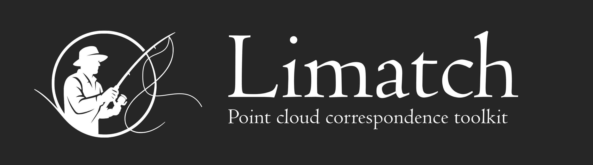
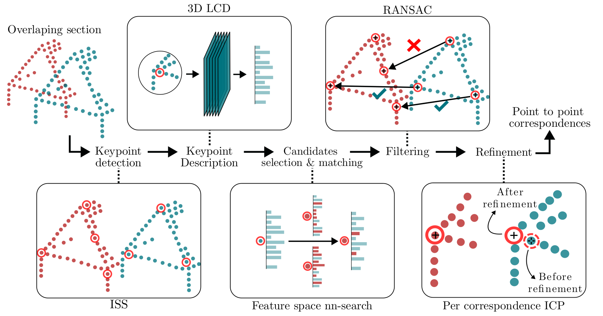
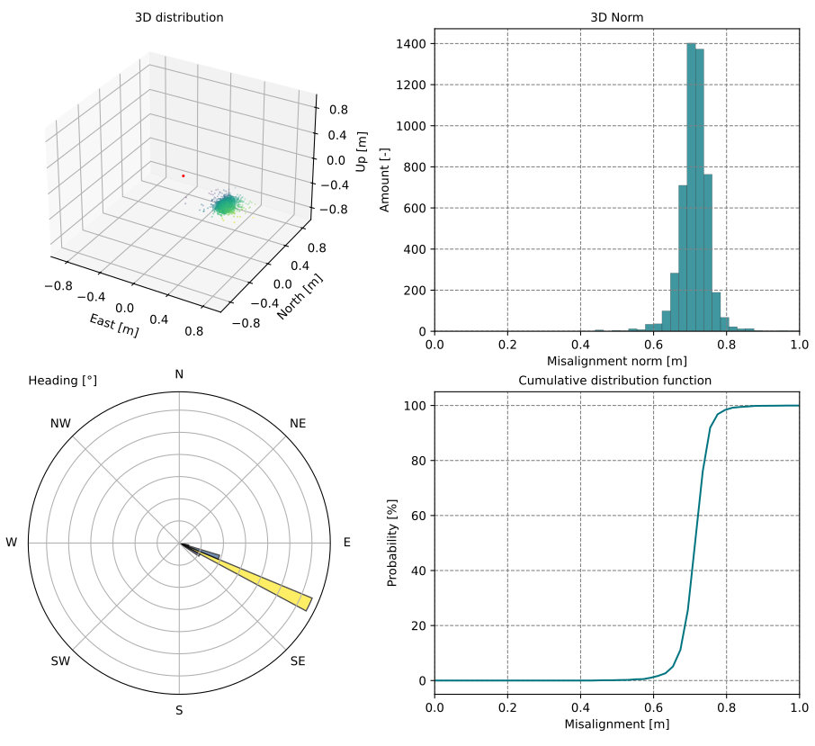
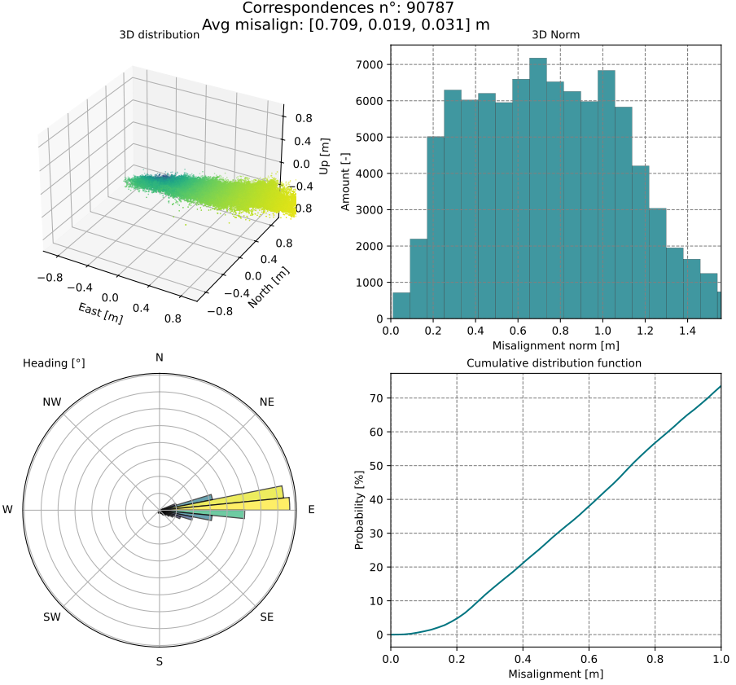

Limatch is the Python implementation of the automated lidar to lidar 3D correspondences retrieval method presented in:

### [[Generalization of point-to-point matching for rigorous optimization in kinematic laser scanning]](https://www.sciencedirect.com/science/article/pii/S0924271625003235)
Aurélien Brun, Jakub Kolecki, Muyan Xiao, Luca Insolia, Elmar Vincent van der Zwan, Stéphane Guerrier, Jan Skaloud

## Introduction

Limatch allows the automated extraction of point to point correspondences between point clouds that partially overlap. Starting from two point cloud files (las, laz or txt), Limatch outputs a set of point to point correspondences that correspond to the same physical entities over the scanned area. These correspondences can be used in several ways such as: refining the trajectory in a factor graph approach (advanced), refining the mounting and boresight parameters of the lidar, or for rigid point cloud registration.

Similar to tie point generation in photogrammetry, but applied to point clouds, Limatch implements steps of keypoints detection, description, matching, filtration and local refinement to output the final correspondences:



More details on the implementation and usage of the correspondences for trajectory refinement in MLS (car), MLS (handheld) and ALS are available in the original paper.

## Usage 

Run the matching pipeline between two example point clouds like this:

```bash
python3 matching_pipeline.py -c1 path_to_cloud_1 -c2 path_to_cloud_2 -y path_to_config.yml

```

Where c1 and c2 must be point cloud with compatible format (las, laz or ascii)

## Installation

Please use the following commands for installation.


```bash
git clone https://github.com/<your-username>/p2p.git

cd p2p

git submodule update --init

conda create -n p2p python==3.9

conda activate p2p

pip3 install torch torchvision

pip3 install -r requirements.txt
```
Note: make sure to download a pytorch + cuda version that is compatible with your NVIDIA drivers, see [here](https://pytorch.org/get-started/previous-versions/)

CUDA is optionnal but recommended for large scale data.

Key dependencies include: 

- [pytorch](https://pytorch.org/)
- [open3d](http://www.open3d.org/)
- [scipy](https://scipy.org/)
- [faiss](https://github.com/facebookresearch/faiss)
- [laspy](https://laspy.readthedocs.io/)

## Data preparation 

The pipeline operates on pairs of partially overlaping point clouds files (.txt, .las or .laz format are currently supported). To get started with a basic extraction, you will only need two point clouds with compatible format and partial overlap as input. Depending on the scanning system and setup (aerial vs terrestrial, indoor vs outdoor), you can adapt one of the configuration provided in the configuration folder, see below.

The example dataset available here can be used along the ALS_close_range.yml configuration template.


## Configuration

We provide 4 template configuration files for the matching pipeline, adapted to:

- outdoor MLS (car)
- mixed indoor/outdoor MLS (handheld)
- close range ALS (UAV/helicopter)
- long range ALS (plane)

Configuration files can be found in **./configs/**.

## Weigths

The description stage relies on a retrained version of [LCD, Learned Cross Domain descriptor](https://github.com/hkust-vgd/lcd)'s 3D encoder. Weigths are available in **./weights/model.pth**

## Results replication

To replicate results presented in the aerial case of [the paper](https://www.sciencedirect.com/science/article/pii/S0924271625003235), please follow the following steps.

#### I. Download required data and configuration
 Go to the following [zenodo record](https://zenodo.org/records/13929655) and download the two baseline point clouds (Baseline_cloud1.txt, Baseline_cloud2.txt). Each text file contains 7 columns and  no header.
- Column 1: time, unit *gps seconds of week*
- Column 2-4: points coordinates (epsg::2056), unit 3x *meters*
- Column 5-7: laser vector (points coordinate in lidar sensor frame), units *meters*  

On the same page, download baseline trajectory in epsg::2056 with 8 columns, no headers.
- Column 1: time, unit *gps seconds of week*
- Column 2-4: body frame position (epsg::2056), unit 3x *meters*
- Column 5-8: body frame orientation (epsg::2056), quaternion w, x, y, z

#### II. Complete the configuration file

In the provided ALS_close_range.yml configuration, update paths to your project folder, to the baseline trajectory and to the descriptor network's weights. 

#### III. Generate point to point correspondences 

Finally, generate point to point correspondences with the matching pipeline by running:

```bash
python3 matching_pipeline.py -c1 path_to/Baseline_cloud1.txt -c2 path_to/Baseline_cloud1.txt -y ALS_close_range.yml

```

#### IV. Interpreting the results

In the **project/plots** subfolder, some figures allow to quickly analize the results.
There important info are provided such as:
- Final number of correspondences
- Average misalignment
- Distribution of the misalignment for all correspondences in 3D, in terms of norm and heading (i.e. direction of the misalignment in the X/Y plane)

**Important note:** the misalignment gives an indication of the nature of the misalignement between both point clouds. If this misalignement is of systematic nature, for example due to a boresight or lever arm error, then the norm, 3d distribution and heading should be strongly clustered as exemplified below




On the contrary if the main source of misalignment in the point cloud is not systematic (e.g. attitude error due to low quality IMU), less clusetering will be observed as seen below. When running on the provided test data, such results is expected since MEMS-IMU as often mounted on drones were used to generate the Baseline point clouds.



#### IV. Refine the trajectory using the correspondences

To use the output correspondences for trajectory refinement in Dynamic Network, please go to the [Online Dynamic Network solver (ODyN) documentation](https://github.com/SMAC-Group/ODyN) and download the example data with [INS/GNSS + LIDAR](https://github.com/SMAC-Group/ODyN/raw/master/data/vallet/INS+lidar.zip). To use your correspondences instead, extract the archive and replace the LiDAR_p2p.txt file content with your output (found in **project_folder/cor_outputs/LiDAR_p2p.txt**). 

You can the zip again the files and run the trajectory estimation in [ODyN](https://odyn.epfl.ch/) with the appropriate configuration, as indicated in the [ODyN documentation](https://github.com/SMAC-Group/ODyN)

## Reference

```
@article{BRUN2025107,
title = {Generalization of point-to-point matching for rigorous optimization in kinematic laser scanning},
journal = {ISPRS Journal of Photogrammetry and Remote Sensing},
volume = {229},
pages = {107-121},
year = {2025},
issn = {0924-2716},
doi = {https://doi.org/10.1016/j.isprsjprs.2025.08.011},
url = {https://www.sciencedirect.com/science/article/pii/S0924271625003235},
author = {Aurélien Brun and Jakub Kolecki and Muyan Xiao and Luca Insolia and Elmar V. {van der Zwan} and Stéphane Guerrier and Jan Skaloud},
keywords = {Kinematic laser scanning, Georeferencing, Sensor fusion, Point-to-point correspondences, Tightly-coupled lidar},
}
```

## Acknowledgements

- [ODyN/DN](odyn.epfl.ch/)
- [LCD](https://github.com/hkust-vgd/lcd)
