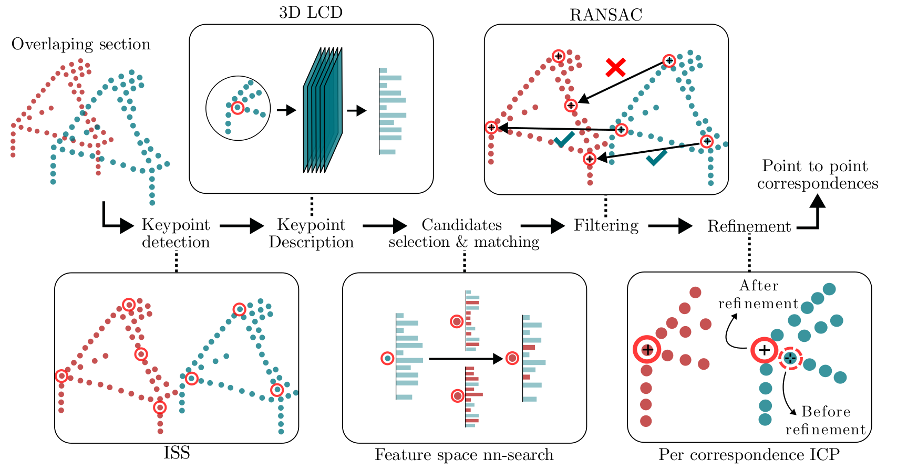

# LiMatch — Point‑to‑Point LiDAR Correspondence Extraction


LiMatch is a Python implementation of the automated LiDAR‑to‑LiDAR 3D correspondence extraction method presented in:

### **[Generalization of point‑to‑point matching for rigorous optimization in kinematic laser scanning](https://www.sciencedirect.com/science/article/pii/S0924271625003235)**  
Aurélien Brun, Jakub Kolecki, Muyan Xiao, Luca Insolia, Elmar Vincent van der Zwan, Stéphane Guerrier, Jan Skaloud

> **Warning**  
> LiMatch is under active development and comes without guarantee.  
> Bug reports, issues and pull requests are very welcome 🙂

---

## Introduction

LiMatch automatically extracts **point‑to‑point correspondences** between two partially overlapping point clouds.  
Starting from two point cloud files (`.las`, `.laz`, or ASCII), LiMatch outputs a set of correspondences that refer to the **same physical entities** observed at different acquisition times.

These correspondences can be used for:
- Rigid point cloud registration
- Mounting / boresight calibration
- Trajectory refinement in factor‑graph frameworks (advanced use case)

Conceptually similar to tie‑point generation in photogrammetry, LiMatch operates directly on 3D point clouds and follows a fully automated pipeline:



The full methodology and applications to MLS and ALS are described in the reference paper.

---

## Modes of Operation

LiMatch supports **two clearly separated modes**, reflected in the code and configuration files.

### 1️⃣ Geometric Matching Only (default)

- No trajectory required
- No laser vectors required
- Purely geometric correspondences + ICP refinement vectors

Typical use cases:
- Rigid registration
- Quality assessment
- Cloud‑to‑cloud alignment diagnostics

### 2️⃣ Trajectory‑Aware Matching (paper use case)

- Requires a trajectory (SBET)
- Requires laser vectors (input or simulated)
- Requires scanner mounting info
- Outputs corrected laser vectors suitable for factor‑graph optimization

Typical use cases:
- Trajectory refinement
- Boresight calibration

The active mode is controlled by the presence and value of `lasvec_source` in the YAML configuration.

---

## Usage

Run the matching pipeline between two point clouds:

```bash
python3 matching_pipeline.py   -c1 path_to_cloud_1   -c2 path_to_cloud_2   -y path_to_config.yml
```

Both clouds must:
- Use compatible formats (`las`, `laz`, or ASCII)
- Share the same coordinate reference system
- Partially overlap in space

---

## Installation

```bash
git clone https://github.com/ESO-EPFL/limatch.git
cd limatch

git submodule update --init

conda create -n limatch python=3.9
conda activate limatch

pip install torch torchvision
pip install -r requirements.txt
```

> **Note**  
> Install a PyTorch build compatible with your CUDA / driver version if GPU acceleration is desired:  
> https://pytorch.org/get-started/previous-versions/

CUDA is optional but strongly recommended for large‑scale datasets.

### Main Dependencies

- [PyTorch](https://pytorch.org/)
- [Open3D](http://www.open3d.org/)
- [SciPy](https://scipy.org/)
- [FAISS](https://github.com/facebookresearch/faiss)
- [laspy](https://laspy.readthedocs.io/)

---

## Data Preparation

LiMatch operates on **pairs of partially overlapping point clouds**:

Supported formats:
- `.las` / `.laz`
- ASCII `.txt`

For ASCII files, the following columns are expected (configurable):
- Time (GPS seconds of week)
- XYZ coordinates
- Optional laser vectors (scanner frame)

Example datasets and configuration templates are provided in the `configs/` folder.

---

## Configuration Overview

Configuration is handled entirely through a YAML file.

Templates are provided for:
- MLS (car)
- Close‑range ALS (UAV / helicopter)
- Long‑range ALS (airplane)

See `configs/` for examples.

### Key Sections

- **General settings**: paths, visualization, logging
- **Data loading**: format, column mapping
- **Tiling & preprocessing**
- **Keypoint detection (ISS)**
- **Descriptor extraction (LCD)**
- **Matching & RANSAC filtering**
- **Local ICP refinement**
- **(Optional) Laser vectors & trajectory**

---

## Coordinate Reference Systems

### Point Cloud CRS (`point_epsg`)

Used **only when simulating laser vectors**.

- If omitted → geometric mode only
- `2056` (LV95) supported with an **approximate** conversion to WGS84  
  (meter‑level bias expected due to missing official transformations in `pyproj`)

This does **not** affect geometric matching quality.

---

## Laser Vectors & Trajectory (Optional)

Activate trajectory‑aware mode by setting:

```yaml
lasvec_source: "input"      # or "simulate"
```

### Laser Vector Sources

- `"input"`  
  Laser vectors are read directly from the point cloud, only for ascii cloud with **lasvec_col** set.

- `"simulate"`  
  Laser vectors are simulated from:
  - Trajectory
  - Scanner‑to‑body mount + boresight (expressed as one combined dcm matrix $R_{scaner}^{body}$)
  - Lever arm

### Required Parameters

```yaml
trajectory: path/to/SBET.out

R_sensor2body:
  - [r11, r12, r13]
  - [r21, r22, r23]
  - [r31, r32, r33]

lever_arm: [dx, dy, dz]
```

SBET rotations follow a **right‑handed, forward‑right‑down body frame** convention.

---

## Outputs

### Correspondences

Saved in `project_folder/cor_outputs/`:

- `corres_*.txt`  
  Correspondences coordinates + ICP vectors ($xyz_a \approx xyz_b + icp_{vec}$)

### Laser‑Vector Outputs (trajectory mode)

- `LiDAR_p2p_rsc_*.txt`  
  Raw laser vectors

- `LiDAR_p2p_*.txt`  
  ICP‑corrected laser vectors

Format:
```
t_b, t_a, vec_b_x, vec_b_y, vec_b_z, vec_a_x, vec_a_y, vec_a_z
```

---

## Replicating Paper Results (ALS Case)

### I. Download Data

From the Zenodo record:  
https://zenodo.org/records/18037973

- Two baseline point clouds (ASCII, EPSG:2056)
- One SBET trajectory

### II. Update Configuration

Edit `ALS_close_range.yml`:
- Project folder
- Trajectory path
- Descriptor weights

### III. Run

```bash
python3 main.py   -c1 Baseline_cloud1.txt   -c2 Baseline_cloud2.txt   -y ALS_close_range.yml
```

### IV. Analyze Results

Figures in `project/plots/` show:
- Number of correspondences
- Misalignment statistics
- Directional clustering (systematic vs random errors)

---

## Using Correspondences for Trajectory Refinement

LiMatch outputs are directly compatible with **ODyN / Dynamic Network**.

Instructions and example datasets:
- https://github.com/SMAC-Group/ODyN
- https://odyn.epfl.ch/

Replace `LiDAR_p2p.txt` with LiMatch output and run the optimization.

---

## Reference

```bibtex
@article{BRUN2025107,
title = {Generalization of point-to-point matching for rigorous optimization in kinematic laser scanning},
journal = {ISPRS Journal of Photogrammetry and Remote Sensing},
volume = {229},
pages = {107--121},
year = {2025},
doi = {10.1016/j.isprsjprs.2025.08.011},
author = {Brun, Aurélien and Kolecki, Jakub and Xiao, Muyan and Insolia, Luca and van der Zwan, Elmar V. and Guerrier, Stéphane and Skaloud, Jan}
}
```

---

## Acknowledgements

- [ODyN / Dynamic Network](https://odyn.epfl.ch/)
- [LCD Descriptor](https://github.com/hkust-vgd/lcd)
